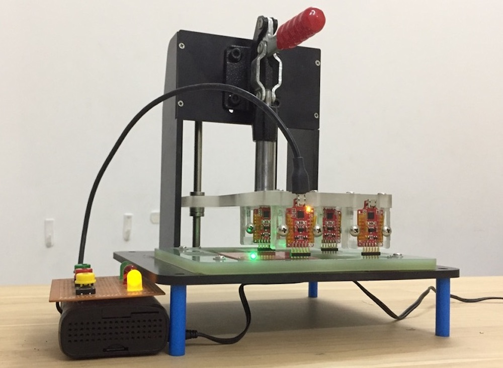
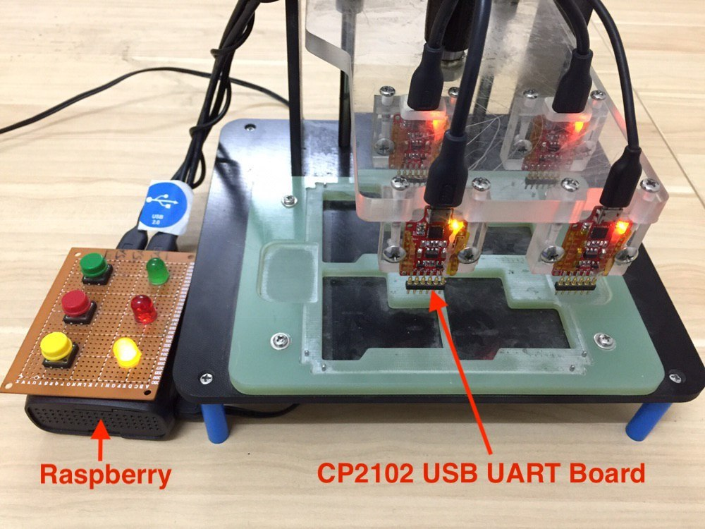
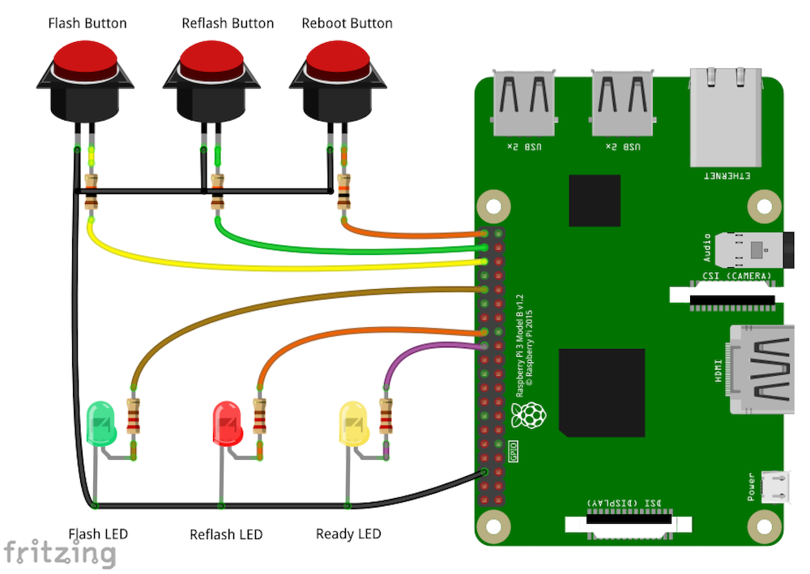
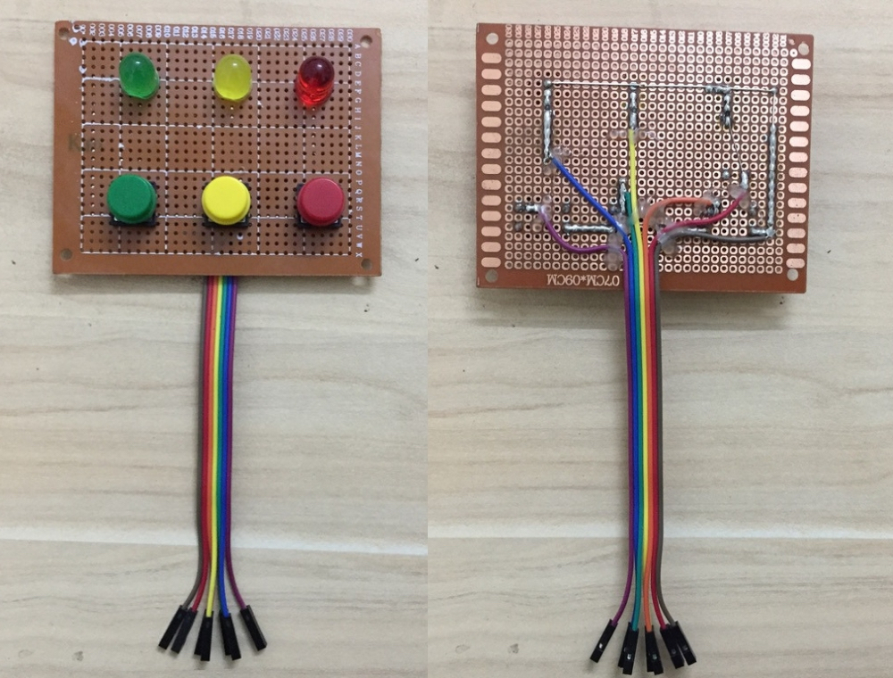

# ESP32 RPI FLASHER




Language: [Việt Nam](./README.vi.md)

## Introduction

When mass-producing ESP32's products we need to have the tool to load the program for the product as quickly as possible. We have several ways to optimize and speed up loading binary firmware for ESP32 as follows:
- Flash multiple products at the same time
- Reduce the binary size
- Speed ​​up the UART baudrate
- Automate loading steps (automatically into bootloader mode ...)

ESP RPI FLASHER is a set of ESP32 multi-board load support tools at the same time including:
- High-speed USB-UART CP2102 board, supporting baudrate speed up to 2Mbps
- The program running on Raspberry Pi can use multiple CP2102 at the same time


The features of the program run on Raspberri Pi as follows:
- Automatically identify the CP2102 that is being connected (can plug multiple via USB port)
- Change firmware for ESP32 easily with configuration file
- Allow reflash failed boards.

## Prepare
* [Raspberry Pi 3 Model B/B+](https://www.raspberrypi.org)
* Thẻ nhớ 16GB
* [CP2102 USB UART board](./esp32_cp_programmer)
* Micro USB Cable, Button, LED, PCB prototype.

**Functianal button and LED**

|  | Function |
|:---:|:---:|
| Flash Button | Click to flash the program |
| Reflash Button | Click to re-flash the failed board |
| Reboot Button | Click to restart Raspberry |
| Flash LED | Report device loading program |
| Reflash LED | Report with loaded board failed |
| Ready LED | Raspberry are ready to be used |

## Steps

### Step 1: Connect device hardware

**Wire connections**



| | Raspberry Pin |
|:---:|:---:|
| Flash Button | 16 |
| Reflash Button | 20 |
| Reboot Button | 21 |
| Flash LED | 12 |
| Reflash LED | 7 |
| Ready LED | 8 |

The control circuit board after welding is fixed



### Step 2: Installing Raspbian for raspberry
* Download the latest Raspbian version [here](https://www.raspberrypi.org/downloads/raspbian/).
* Extract the downloaded file (the file after extracting has `.img` extension).
* Insert a memory card, open the terminal and execute the `sudo fdisk -l` command
* Determine the disk name when inserting a memory card, usually /dev/mmcblk0.
* Continue to execute the commands:
     * `cd Downloads /`
     * `sudo dd bs = 4M if = 2017-07-05-raspbian-jessie-lite.img of = /dev/mmcblk0`
* Note: The `cd Downloads/` command is used to go to the directory containing the installation file.
* Once done, we have a memory card that can boot Raspbian.

**Ref:** [Cách cài đặt hệ điều hành raspbian cho raspberry.](https://www.raspberrypi.org/documentation/installation/installing-images/)

**Setting Wifi and SSH to Raspberry PI**
* Remove the memory card and plug it back into the computer. At this time, The Linux/Ubuntu OS will mount 2 partitions, `boot` partition and `rootfs` partition.
* using `rootfs`, and open **/etc/wpa-supplicant/wpa-supplicant.conf** in this directory:
* Edit that file with this conntent:
```
ctrl_interface=DIR=/var/run/wpa_supplicant GROUP=netdev
update_config=1
network={
  ssid="your ssid"
  psk="your pass"
}
```

* Since November 2016, Raspberry has locked SSH when starting. To unlock SSH, create an `ssh` file (note: this file does not have an extension) in the boot partition of SD Card.
* Insert the memory card into RPI and wait for it to start in about 1 minute.
* Find the IP address of raspberry by logging in to the configuration page of WiFi Modem (for example: http://192.168.1.1). Almost all modems will display the DHCP Client list, find whichever host name is raspberrypi, get that IP, for example 192.168.1.12. In addition, some IP scanning software support such as [Angry IP Scanner](https://angryip.org/download/#mac).
* Open terminal up, ssh to raspberry's IP address: `ssh pi @ 192.168.1.12` and type the password:` raspberry` (Note the computer needs to use the same network with raspberry).
* So finished installing Raspbian for Raspberry Pi.

### Step 3: Install script

* Open the terminal, ssh by `ssh pi@192.168.1.12` with password: `raspberry`.
* Clone project: `git clone --recursive https://github.com/tuanpmt/esp_rpi_flasher.git`

**Note:** By default, the project needs to be saved in the **/home/pi** directory, if you want to save the script to another location, refer to [Configuring directory path](#Configuration-picture-path-letter-item).

* Install python and provide the firmware to the correct directory (using the `firmware_examples`):

```
sudo pip install -r requirements.txt
``` 

### Step 4: Set up auto-run script when raspberry starts
* After installing the raspberry script, check the current directory path with the command: `$PWD` (the default path is /home/pi/esp_rpi_flasher)
* Type `sudo nano /home/pi/.bashrc` to edit the **.Bashrc** file
* Add the following content to the last line of the file **.Bashrc**

```
echo Running at boot 
sudo /usr/bin/python3 /home/pi/esp_rpi_flasher/flasher.py &
```

With: `/home/pi/esp_rpi_flasher/flasher.py` is the default path of the project, if the script is saved in another location
* Nhấn **Ctrol** + **x** để save và reboot raspberry bằng lệnh `sudo reboot`.

Check out some more ways to run scripts when starting raspbian [here](https://www.dexterindustries.com/howto/run-a-program-on-your-raspberry-pi-at-startup/)

## Notes

The basic settings and firmware will be saved in the `/boot/firmware` path as follows:

```
boot
├──firmware
    ├──config.ini
    ├──encrypted
        ├──app-encrypted.bin
        ├──bootloader-reflash-digest-encrypted.bin
        ├──ota_data_initial-encrypted.bin
        ├──partitions-encrypted.bin
        ├──flash_encryption_key_1.0.0.alpha.4.bin
        ├──secure-bootloader-key-256.bin
    ├──normal
        ├──app.bin
        ├──bootloader.bin
        ├──ota_data_initial.bin
        ├──partitions.bin
```

Inside:
* **config.ini**: File stores configurations such as: LED pins, buttons and firmware paths, ...
* **encrypted**: The directory contains the encrypted firmware (used when loading programs that can boot boot and flash encryption).
* **normal**: The folder contains unencrypted firmware (used when loading regular programs).

### Secure boot and flash encryption
By default the script will load the program in the usual way (without secure boot and flash encryption). Enter the `/boot/firmware/` directory and open the `config.ini` file and edit `isEncrypt = True` to load the program to secure boot and flash encryption.

### Configure directory path
By default the script needs to be saved under the path `/home/pi` however, if you want to save the script in another directory you need to edit:
* When completing step 1, step 2, step 3, in the `/boot/firmware/` directory open the **config.ini** file and change the path of **projectPath**
* In step 4: Automatically run the script when starting raspbian, need to change the path to the **flasher.py** file

### Raspberry configuration and Button of Raspberry

LED and push button have been declared by default as Step 1 if you want to change the LED connector pins and Button with raspberry, proceed to the `/boot/firmware/` folder open the ** config.ini file ** and change the LED and Button pins accordingly.

## Video

[](https://youtu.be/gd818KGObi0 "ESP RPI FLASHER")

## Ref

* [Raspberry Pi3 model B/B+](https://www.raspberrypi.org/products/raspberry-pi-3-model-b-plus/)
* [Install Raspbian for raspberry](https://www.raspberrypi.org/documentation/installation/installing-images/)
* [Five Ways To Run a Program On Raspberry Pi At Startup](https://www.dexterindustries.com/howto/run-a-program-on-your-raspberry-pi-at-startup/)
* [Wiring Fritzing](images/wiring.fzz)
