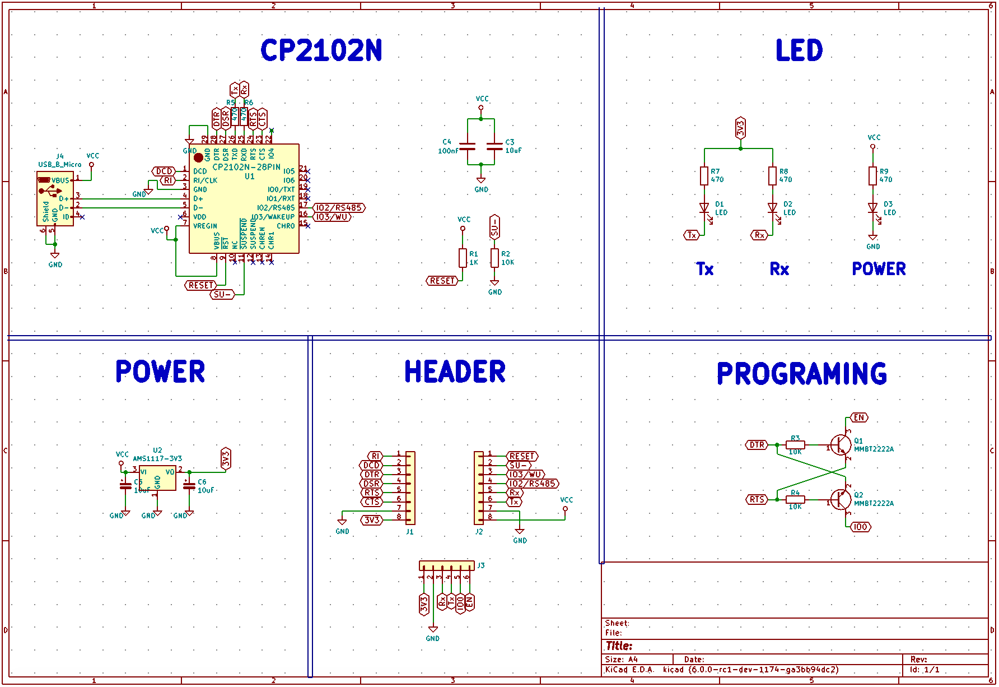
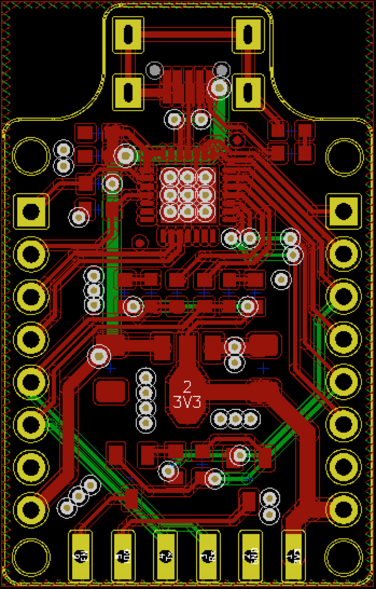
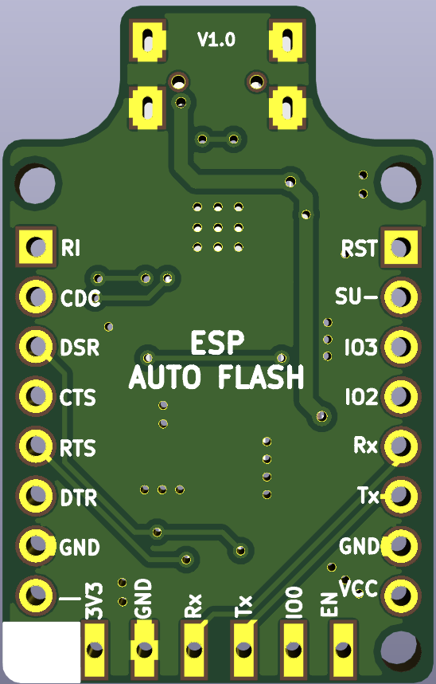

# ESP32 Progammer

## Features

ESP32 Progammer
- Size: 22x30.5 mm.
- Intergrate micro USB.
- Input Voltage: 5v (Vusb).
- Open hardware with CC-BY-SA license.
- Design with KiCad.

## Hardware

### Schematics

### PCB Layout

### 3D

### Pinout 

### Fritzing part 

### Gerber

* [Gerber 1 board](./assets/auto-flash-esp32-22x36,5mm.zip)
* [Gerber panel 8 board](./assets/auto-flash-panel-8-board-94x71mm.zip)

### BOM 
| Component | Description | Part | References | Value | Footprint | Quantity Per PCB | link |
|-----------|-------------|------|------------|-------|-----------|------------------|-----------|
| 1 | Unpolarized capacitor | C	| C1 C2 C3 | 100nF | C_0603 | 3 | |	
| 2 | Unpolarized capacitor | C	| C4 C5	| 4.7uF	| C_0603 | 2 | |	
| 3 | LED generic | LED	| D1 D2 D3 | LED | LED_0603 | 3 | |	
| 4 | Generic connector, single row, 01x06 | Conn_01x06	| J3 | Conn_01x06 | Pin_Header_Straight_1x06_Pitch2.54mm | 1 | [link](https://item.taobao.com/item.htm?id=524060094118) |	
| 5 | Generic connector, single row, 01x08 | Conn_01x08	| J1 J2 | Conn_01x08 | Pin_Header_Straight_1x08_Pitch2.54mm | 2 | |	
| 6 | USB Micro Type B connector | USB_B_Micro	| J4 | USB_B_Micro | MicroUSB-B	| 1 | |	
| 7 | Transistor NPN (general) | Q_NPN_BEC | Q1 Q2 | Q_NPN_BEC | SOT-23_standar | 2 | |	
| 8 | Resistor | R | R2 R3 R4 | 10K | R_0603 | 3 | |	
| 9 | Resistor | R | R1	| 1K | R_0603 | 1 | |
| 10 | Resistor | R | R7 R8 R9 | 220 | R_0603 | 3 |  |	
| 11 | Resistor | R | R5 R6 | 470 | R_0603 | 2 | |
| 12 | | CP2102N | U1 | CP2102N | cp2102 | 1 | [link](https://item.taobao.com/item.htm?id=563461942639) |	

### Remark

This project was in development phase - we will remove this remark after release

# License

